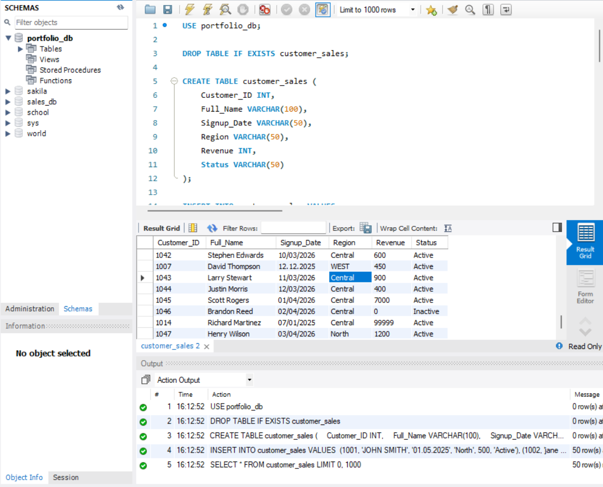
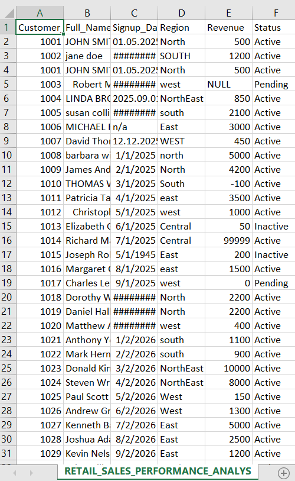
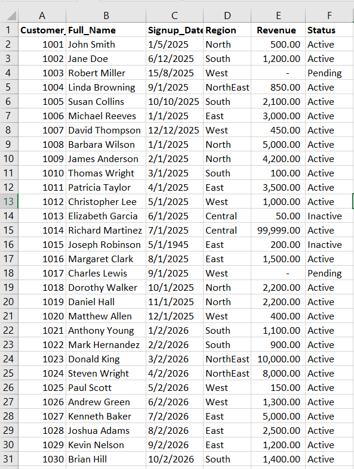
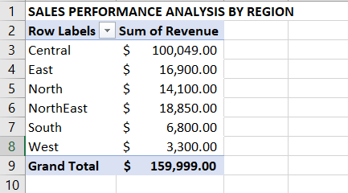
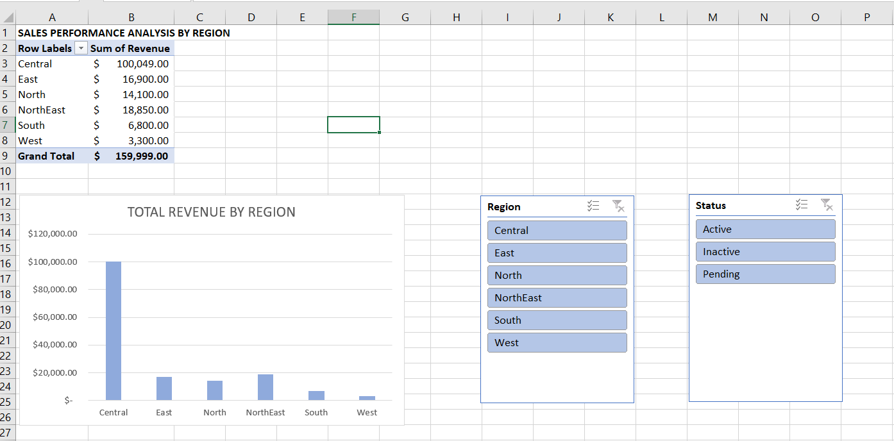

# Retail Sales Analysis: SQL to Interactive Dashboard

## Project Overview
This project demonstrates an end-to-end data pipeline. I extracted raw sales data using **SQL**, performed advanced data cleaning in **Excel**, and built an interactive **Pivot Table Dashboard** to visualize regional sales performance.

---

## Phase 1: Data Extraction (SQL)
I developed a relational database in MySQL to store and manage customer and transaction records.
* **Task**: Created tables and populated them with raw data using `CREATE` and `INSERT` statements.
* **Interface**: Managed the extraction process through MySQL Workbench.

---

## Phase 2: Identifying Inconsistencies & Data Cleaning
Before analysis, I identified several data quality issues in the raw export, including messy text, extra spaces, and inconsistent date formats.

### Cleaning Steps Taken:
* **Text Standardization**: Applied `=PROPER(TRIM())` to fix irregular capitalization and extra spaces in names.
* **Date Repair**: Resolved mixed date delimiters (periods vs. slashes) using the Text-to-Columns wizard to ensure chronological accuracy.
* **Deduplication**: Identified and removed duplicate rows to ensure data integrity.

---

## Phase 3: Data Visualization & Insights
I utilized **Pivot Tables** and **Pivot Charts** to extract meaningful business insights from the cleaned dataset.

### Key Findings:
* **Regional Leaders**: The **Central** region generated the highest revenue, exceeding **$100,049**.
* **Interactivity**: Built-in **Slicers** allow stakeholders to filter by **Region** and **Status** instantly.

